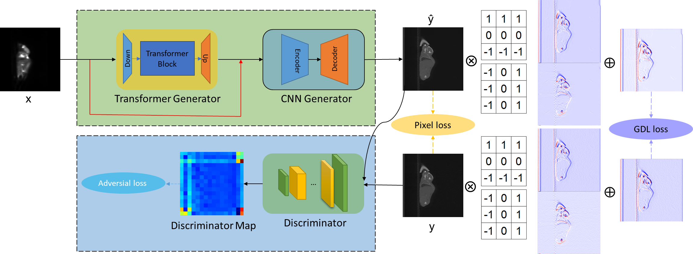
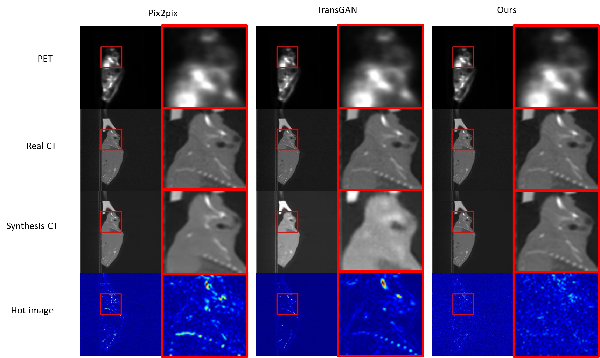

# TCGAN

The implemetation of the paper "TCGAN"

After the paper is accepted, we will continue to improve the content of the document, including the ideas of the paper and specific experimental methods.


## 1. Dataset

Madic: Temporarily unavailable until permission is granted.
BraTs2020: https://www.med.upenn.edu/cbica/brats2020/data.html (The preprocessing code is placed here: ``utils/pre_brats_data.py``)

IXI: You can download the dataset from [here](https://drive.google.com/drive/u/0/folders/1En_S9c081T2hV-joaFJv3xlMX2Eqzl5V), (Preprocessed dataset source: https://github.com/icon-lab/pGAN-cGAN)


## 2.Methods








## 3. Usage


### 3.1 Train

```shell
python train.py　--path /data/root --n_epochs 0 --ever_hum 2000 --dataset_name exp --batch_size 12 --lr 2e-4 --n_cpu 1 --img_height 256 --img_width 256 --channels 3 --checkpoint_interval 100 --lambda_pixel 50
```

### 3.2 Test

```shell
python test.py
```


